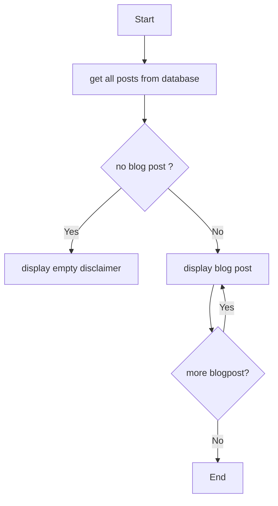
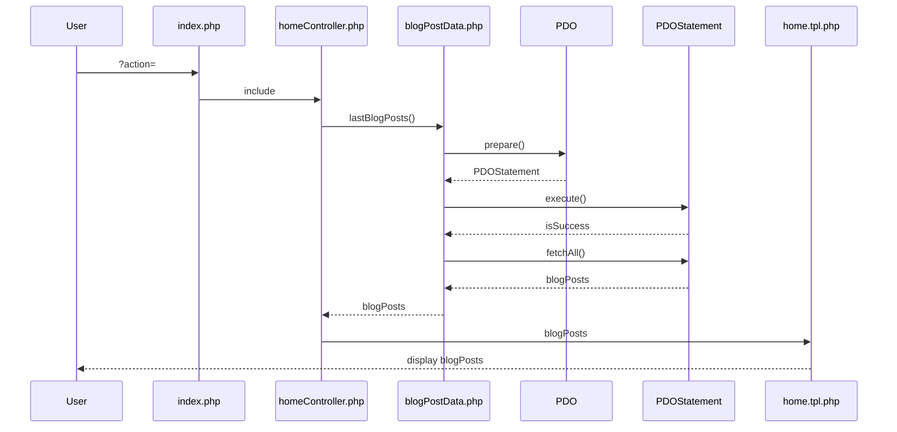
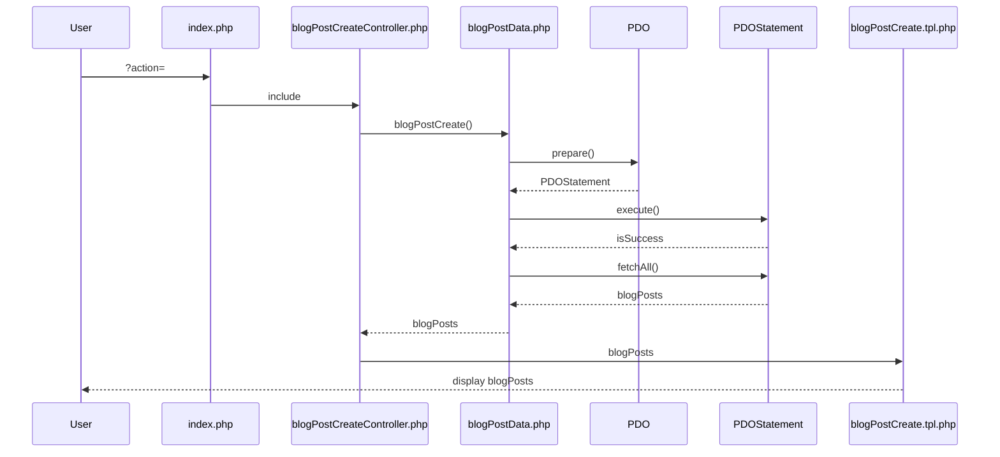

```mermaid
graph TD
    A[Start] --> B[get all posts from database]
    B --> C{no blog post ?}
    C -- Yes --> D[display empty disclaimer]
    C -- No --> E[display blog post]
    E --> F{more blogpost?}
    F -- Yes --> E
    F -- No --> G[End]
```

```mermaid
sequenceDiagram
    User ->> index.php: ?action=
    index.php ->> homeController.php: include
    homeController.php ->> blogPostData.php: lastBlogPosts()
    blogPostData.php ->> PDO: prepare()
    PDO -->> blogPostData.php: PDOStatement
    blogPostData.php ->> PDOStatement: execute()
    PDOStatement -->> blogPostData.php: isSuccess
    blogPostData.php ->> PDOStatement: fetchAll()
    PDOStatement -->> blogPostData.php: blogPosts
    blogPostData.php -->> homeController.php: blogPosts
    homeController.php ->> home.tpl.php: blogPosts
    home.tpl.php -->> User: display blogPosts
```

[//]: # (3.1)

```mermaid
sequenceDiagram
    User ->> index.php: ?action=
    index.php ->> homeController.php: include
    homeController.php ->> blogPostData.php: lastBlogPosts()
    blogPostData.php ->> PDO: prepare()
    PDO -->> blogPostData.php: PDOStatement
    blogPostData.php ->> PDOStatement: execute()
    PDOStatement -->> blogPostData.php: isSuccess
    blogPostData.php ->> PDOStatement: fetchAll()
    PDOStatement -->> blogPostData.php: blogPosts
    blogPostData.php -->> homeController.php: blogPosts
    homeController.php ->> home.tpl.php: blogPosts
    home.tpl.php -->> User: display blogPosts
```

[//]: # (4.1)

```mermaid
sequenceDiagram
    User ->> index.php: ?action=
    index.php ->> blogPostCreateController.php: include
    blogPostCreateController.php ->> blogPostData.php: blogPostCreate()
    blogPostData.php ->> PDO: prepare()
    PDO -->> blogPostData.php: PDOStatement
    blogPostData.php ->> PDOStatement: execute()
    PDOStatement -->> blogPostData.php: isSuccess
    blogPostData.php ->> PDOStatement: fetchAll()
    PDOStatement -->> blogPostData.php: blogPosts
    blogPostData.php -->> blogPostCreateController.php: blogPosts
    blogPostCreateController.php ->> blogPostCreate.tpl.php: blogPosts
    blogPostCreate.tpl.php -->> User: display blogPosts
```